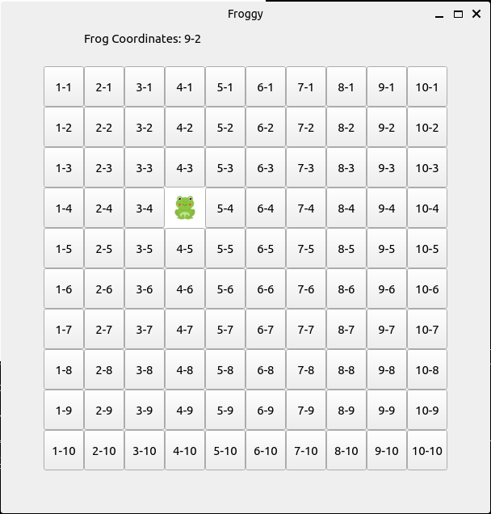

# FROG GAME

This game is written on Python using PyQt5 library. This project was made to master basic features of PyQt5 library such as simple styling and event listeners

## Project setup

In order to run this game on your local machine you need to install PyQt5 library:

```
pip install PyQt5
```

## Controls

To move Frog - use your keyboard: W,A,S,D

To create the obstacles for your Frog just click on the square you dont want it to go 



